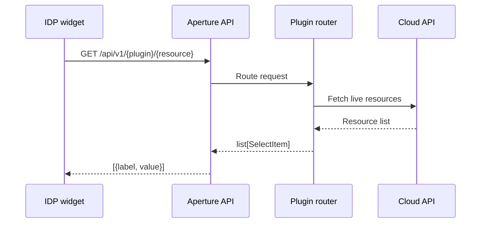
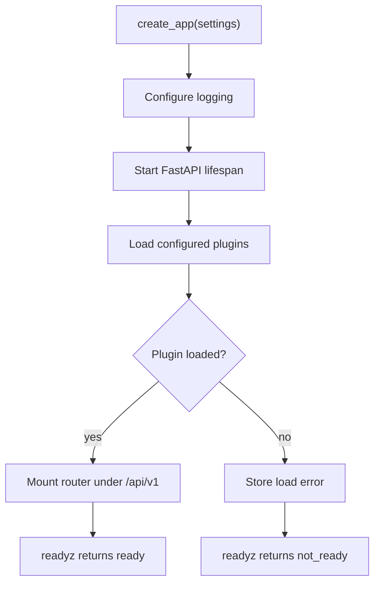
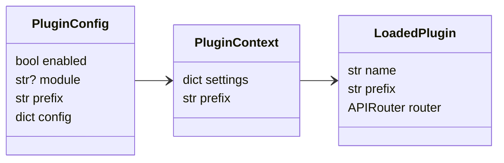
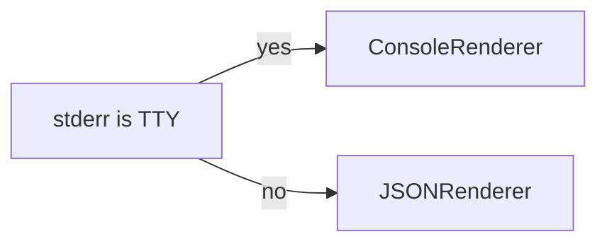
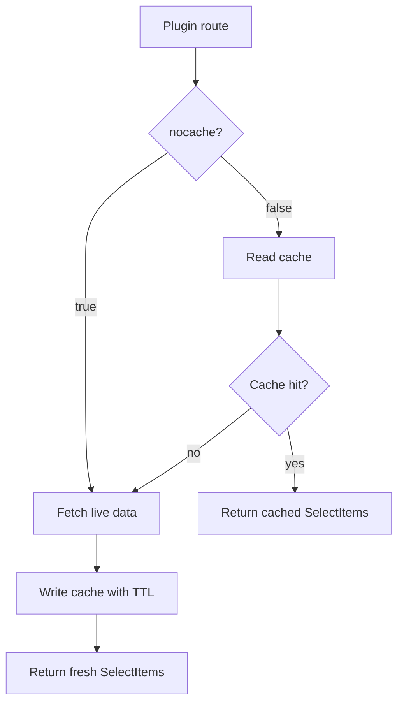

# Aperture


Aperture is an internal REST API for dynamic select widgets.

It gives platform forms live choices like VPCs, subnets, instance types, snapshots,
and other cloud resources. The public select contract is always:

```json
[
  {"label": "my-vpc-name - vpc-0abc123", "value": "vpc-0abc123"}
]
```

## Quick Start

```bash
uv sync --all-groups
task up
```

Docker Compose guide: [docs/getting-started/demo/README.md](docs/getting-started/demo/README.md).

Useful checks:

```bash
task lint
task type:check
task fmt:check
task test
```

## API Shape

Technical probes stay outside the select contract:

```text
GET /livez
GET /readyz
```

Select and admin routes live under:

```text
/api/v1
```

Current admin routes:

```text
GET /api/v1/admin/plugins
GET /api/v1/admin/routes
GET /api/v1/admin/settings
```

## Runtime Flow



## Application Startup



## Plugin Contract

Each plugin is a Python module with a router factory:

```python
def create_router(context: PluginContext) -> APIRouter:
    ...
```



## Configuration

Aperture reads `settings.yml` or `settings.yaml`, then `APT_*` environment
variables can override those values.

Example:

```yaml
port: 8000
log_level: info
cache_backend: memory

plugins:
  admin:
    enabled: true
    module: aperture.plugins.admin.main
    prefix: /admin
    config: {}
```

Environment override example:

```bash
APT_PORT=9000 task up
```

## Logging

Logging uses `structlog`.



Local runs get readable console logs. Containers get JSON logs for log
collectors.

## Cache Contract

Aperture gives plugins one shared async cache store. The default backend is
memory. Redis can be enabled with settings.



Cache keys use this shape:

```text
plugin:{plugin}:resource:{resource}:scope:{scope...}:params:{hash(params)}
```

The plugin name is always part of the key. Scope segments are chosen by the
plugin, so a cloud plugin can include account and region while a GitLab plugin
can include a group or namespace. Aperture does not use legacy Compass Redis
keys by default.

Plugins choose the TTL that fits each resource. Query parameters that only
change display, like empty options or filtering, should stay out of cache keys.
Synthetic empty select options should be added after cache reads and never
stored in cache.

## Test Rules

- Tests use `pytest`.
- Test files do not use classes.
- JSON examples stay inline in tests.
- Plugin-specific tests live next to the plugin.
