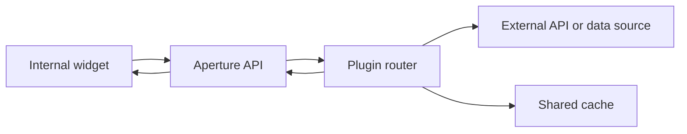

# Architecture

Aperture is a small FastAPI runtime that loads plugin routers.

The core owns:

- app startup and shutdown
- settings
- logging
- auth
- error responses
- cache abstraction
- plugin loading

Plugins own resource-specific routes and external API calls.
