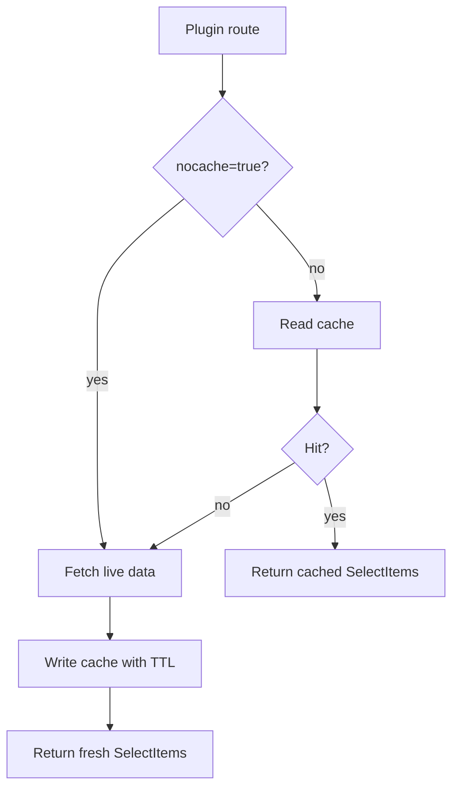

# Cache Design

Aperture gives plugins one shared async cache store.

The cache keeps expensive external lookups out of repeated select requests.



Cache keys use this shape:

```text
plugin:{plugin}:resource:{resource}:scope:{scope...}:params:{hash(params)}
```

Scope is plugin-owned. A cloud plugin can use account and region. A GitLab
plugin can use group or namespace.
