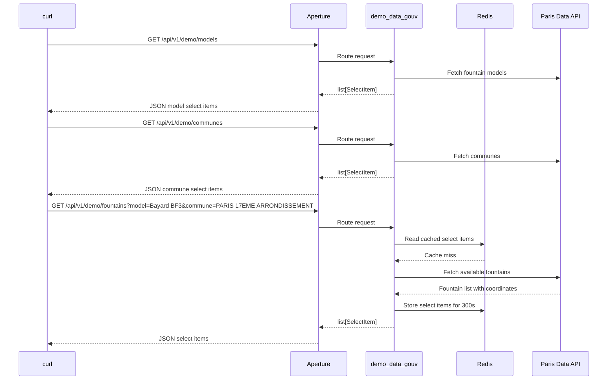

# Getting Started With Docker Compose

This guide starts Aperture with Redis and one small demo plugin.

The demo plugin lists Paris drinking fountains from open data and returns them
as select items. It uses the Paris Data API for the `fontaines-a-boire`
dataset. It is only an example plugin. It does not belong in the Aperture core
package.

## Files

The complete example lives in:

```text
docs/getting-started/demo/
```

Important files:

```text
docs/getting-started/demo/
  Dockerfile
  docker-compose.yml
  settings.yaml
  demo_plugins/
    __init__.py
    demo_data_gouv.py
```

## Plugin

The demo plugin is configured in
`docs/getting-started/demo/settings.yaml`:

```yaml
demo_data_gouv:
  enabled: true
  module: demo_plugins.demo_data_gouv
  prefix: /demo
  config:
    page_size: 25
    ttl_seconds: 300
```

The plugin routes are:

```text
GET /api/v1/demo/models
GET /api/v1/demo/communes
GET /api/v1/demo/fountains
GET /api/v1/demo/fountains?model=<model-value>
GET /api/v1/demo/fountains?commune=<commune-value>
```

Model items use the model as both label and value.
Commune items use the commune as both label and value.

Fountain items use:

```text
label = modele - voie - commune
value = lat,lon
```

Example response:

```json
[
  {
    "label": "Mât source - QUAI BRANLY - PARIS 15EME ARRONDISSEMENT",
    "value": "48.855602411748905,2.2898925039174176"
  }
]
```

The plugin also uses Redis through the Aperture cache helpers. Add
`?nocache=true` to force a live Paris Data lookup and refresh Redis.

## Run

From the repository root:

```bash
cd docs/getting-started/demo
docker compose up --build
```

Then test the technical probes:

```bash
curl http://127.0.0.1:8000/livez
curl http://127.0.0.1:8000/readyz
```

Test the demo plugin:

```bash
curl http://127.0.0.1:8000/api/v1/demo/fountains
```

Test the cascade flow:

```bash
curl http://127.0.0.1:8000/api/v1/demo/models
curl http://127.0.0.1:8000/api/v1/demo/communes
curl --get http://127.0.0.1:8000/api/v1/demo/fountains \
  --data-urlencode "model=Bayard BF3"
curl --get http://127.0.0.1:8000/api/v1/demo/fountains \
  --data-urlencode "commune=PARIS 17EME ARRONDISSEMENT" \
  --data-urlencode "commune=PARIS 19EME ARRONDISSEMENT"
```

`--data-urlencode` keeps model values with spaces safe in the URL. The manual
URL encoded form for one model is:

```bash
curl "http://127.0.0.1:8000/api/v1/demo/fountains?model=Bayard%20BF3"
```

## Flow


