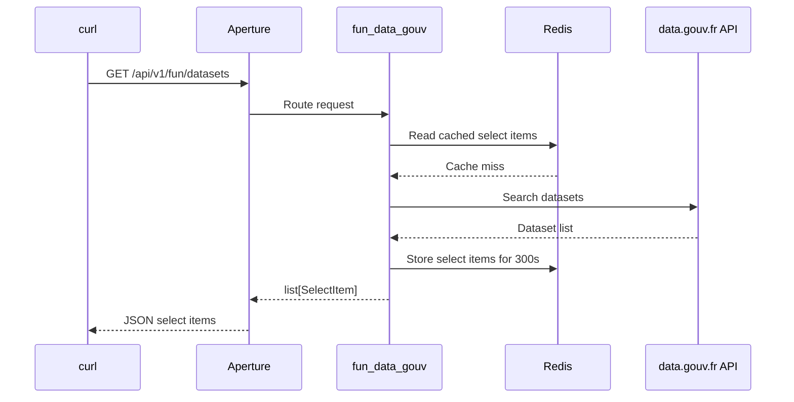

# Getting Started With Docker Compose

This guide starts Aperture with Redis and one small demo plugin.

The demo plugin searches data.gouv.fr and returns fun datasets as select items.
It is only an example plugin. It does not belong in the Aperture core package.

## Files

Create this local tree:

```text
demo/
  Dockerfile
  docker-compose.yml
  settings.yaml
  demo_plugins/
    __init__.py
    fun_data_gouv.py
```

Keep `demo_plugins/__init__.py` empty.

## Dockerfile

```dockerfile
FROM python:3.14-slim

WORKDIR /app

COPY pyproject.toml uv.lock README.md ./
COPY aperture ./aperture
COPY demo/demo_plugins ./demo_plugins
COPY demo/settings.yaml ./settings.yaml

RUN pip install --no-cache-dir uv \
    && uv sync --frozen --no-dev

ENV PYTHONPATH=/app

CMD ["uv", "run", "aperture"]
```

## docker-compose.yml

```yaml
services:
  redis:
    image: redis:8-alpine
    ports:
      - "6379:6379"

  aperture:
    build:
      context: ..
      dockerfile: demo/Dockerfile
    depends_on:
      - redis
    ports:
      - "8000:8000"
    environment:
      APT_LISTEN_ADDR: "0.0.0.0"
      APT_PORT: "8000"
      APT_SERVICE_NAME: "aperture-demo"
      APT_CACHE_BACKEND: "redis"
      APT_REDIS_URL: "redis://redis:6379/0"
    volumes:
      - ./settings.yaml:/app/settings.yaml:ro
```

## settings.yaml

```yaml
plugins:
  admin:
    enabled: true
    module: aperture.plugins.admin.main
    prefix: /admin
    config: {}

  fun_data_gouv:
    enabled: true
    module: demo_plugins.fun_data_gouv
    prefix: /fun
    config:
      query: "insolite"
      page_size: 5
      ttl_seconds: 300
```

## demo_plugins/fun_data_gouv.py

```python
"""Demo plugin that searches funny datasets on data.gouv.fr."""

import asyncio
import json
from urllib.parse import urlencode
from urllib.request import Request, urlopen

from fastapi import APIRouter, Request as FastAPIRequest

from aperture.cache.store import (
    build_cache_key,
    safe_get_cache,
    safe_set_cache,
    should_bypass_cache,
)
from aperture.logger import get_logger
from aperture.models.select_item import SelectItem
from aperture.plugins.loader import PluginContext


def create_router(context: PluginContext) -> APIRouter:
    """Create routes for the data.gouv.fr demo plugin."""

    router = APIRouter(tags=["fun-data-gouv"])
    log = get_logger(__name__)

    @router.get("/datasets", response_model=list[SelectItem])
    async def list_fun_datasets(request: FastAPIRequest) -> list[SelectItem]:
        """Return a few data.gouv.fr datasets as select items."""

        query = str(context.settings.get("query", "insolite"))
        page_size = int(context.settings.get("page_size", 5))
        ttl_seconds = int(context.settings.get("ttl_seconds", 300))
        cache_key = build_cache_key(
            plugin="fun_data_gouv",
            resource="datasets",
            params={"query": query, "page_size": page_size},
        )
        cache = context.cache
        bypass_cache = should_bypass_cache(request.query_params.get("nocache"))
        if cache is not None and not bypass_cache:
            cached_items = await safe_get_cache(cache, cache_key, logger=log)
            if cached_items is not None:
                return [SelectItem.model_validate(item) for item in cached_items]

        payload = await asyncio.to_thread(
            _search_datasets,
            query=query,
            page_size=page_size,
        )
        datasets = payload.get("data", [])
        if not isinstance(datasets, list):
            datasets = []
        items = [
            SelectItem(
                label=dataset["title"],
                value=dataset["slug"],
            )
            for dataset in datasets
            if isinstance(dataset, dict)
            and dataset.get("title")
            and dataset.get("slug")
        ]

        if cache is not None:
            await safe_set_cache(
                cache,
                cache_key,
                [item.model_dump() for item in items],
                ttl=ttl_seconds,
                logger=log,
            )

        return items

    return router


def _search_datasets(query: str, page_size: int) -> dict[str, object]:
    """Search data.gouv.fr with the public catalog API."""

    params = urlencode({"q": query, "page_size": page_size})
    request = Request(
        f"https://www.data.gouv.fr/api/1/datasets/?{params}",
        headers={"User-Agent": "aperture-demo/0.1"},
    )
    with urlopen(request, timeout=10) as response:
        return json.loads(response.read().decode("utf-8"))
```

## Run

From the `demo/` folder:

```bash
docker compose up --build
```

Then test the technical probes:

```bash
curl http://127.0.0.1:8000/livez
curl http://127.0.0.1:8000/readyz
```

Test the demo plugin:

```bash
curl http://127.0.0.1:8000/api/v1/fun/datasets
```

The response keeps the Aperture select contract:

```json
[
  {
    "label": "Example dataset title",
    "value": "example-dataset-slug"
  }
]
```

## Flow



Redis is running in this compose stack so plugin authors can test the shared
cache backend. Add `?nocache=true` to the request to force a live data.gouv.fr
lookup.
