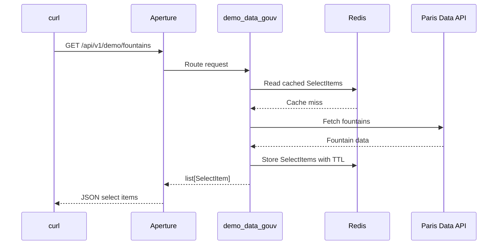

# Run The Docker Compose Demo

This tutorial starts Aperture with Redis and one demo plugin.

The demo plugin lists Paris drinking fountains from open data and returns them
as `SelectItem` values.

## Files

The runnable files live in:

```text
docs/tutorials/docker-compose-demo/
```

Important files:

```text
docs/tutorials/docker-compose-demo/
  Dockerfile
  docker-compose.yml
  settings.yaml
  demo_plugins/
    demo_data_gouv.py
```

## Start The Stack

From the repository root:

```bash
cd docs/tutorials/docker-compose-demo
docker compose up --build
```

## Check The API

In another shell:

```bash
curl http://127.0.0.1:8000/livez
curl http://127.0.0.1:8000/readyz
```

## Query The Demo Plugin

List fountain models:

```bash
curl http://127.0.0.1:8000/api/v1/demo/models
```

List communes:

```bash
curl http://127.0.0.1:8000/api/v1/demo/communes
```

List fountains:

```bash
curl http://127.0.0.1:8000/api/v1/demo/fountains
```

Filter by model:

```bash
curl --get http://127.0.0.1:8000/api/v1/demo/fountains \
  --data-urlencode "model=Bayard BF3"
```

Filter by several communes:

```bash
curl --get http://127.0.0.1:8000/api/v1/demo/fountains \
  --data-urlencode "commune=PARIS 17EME ARRONDISSEMENT" \
  --data-urlencode "commune=PARIS 19EME ARRONDISSEMENT"
```

Use `--data-urlencode` for values with spaces.

## Refresh The Cache

Add `nocache=true` to bypass the cache read and refresh Redis with live data:

```bash
curl "http://127.0.0.1:8000/api/v1/demo/fountains?nocache=true"
```

## Flow



## Stop The Stack

From the demo folder:

```bash
docker compose down --remove-orphans
```
