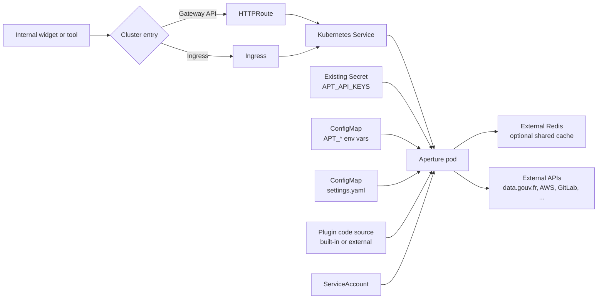

# aperture

Internal REST API for dynamic-select widgets.

## Install

```bash
helm upgrade --install aperture ./helm/aperture
```

Use the example values files to separate environments:

```bash
helm upgrade --install aperture ./helm/aperture -f helm/aperture/values-nonprod.yaml
helm upgrade --install aperture ./helm/aperture -f helm/aperture/values-prod.yaml
```

## Production Notes

- Set `auth.mode=api_key` in production.
- Store API keys in an existing Kubernetes Secret.
- Set `serviceAccount.annotations` when your cluster uses workload identity.
  Examples include EKS IRSA, GKE Workload Identity, AKS Workload Identity,
  or a lab-specific identity integration.
- Use Gateway API when your platform supports it. Keep Ingress for older or
  simpler clusters.
- Redis is external. This chart configures the Redis URL but does not deploy Redis.

## Runtime Links



## Configuration Split

The chart uses two ConfigMaps on purpose:

- `aperture-env` contains simple `APT_*` environment variables. These values
  are easy to override per environment.
- `aperture-settings` contains `settings.yaml`. This is easier to read for
  nested plugin configuration.

Pydantic loads `settings.yaml` first, then `APT_*` environment variables can
override it.

Example `aperture-env`:

```yaml
data:
  APT_SERVICE_NAME: "aperture-prod"
  APT_LOG_LEVEL: "info"
  APT_CACHE_BACKEND: "redis"
  APT_REDIS_URL: "redis://redis.example:6379/0"
  APT_AUTH_MODE: "api_key"
```

Example `aperture-settings`:

```yaml
data:
  settings.yaml: |
    auth_skip_paths:
      - /
      - /livez
      - /readyz
    plugins:
      admin:
        enabled: true
        module: aperture.plugins.admin.main
        prefix: /admin
        config: {}
      demo:
        enabled: true
        module: demo_plugins.demo_data_gouv
        prefix: /demo
        config:
          query:
            dataset: fontaines-a-boire
            fields:
              - modele
              - commune
```

## Values

| Key | Type | Default | Description |
|-----|------|---------|-------------|
| affinity | object | `{}` | Affinity rules for pod scheduling. |
| aperture.cacheBackend | string | `"memory"` | Cache backend. Use memory for simple runs, redis for shared cache. |
| aperture.cacheDefaultTtlSeconds | int | `300` | Default cache TTL in seconds. |
| aperture.listenAddr | string | `"0.0.0.0"` | HTTP listen address inside the pod. |
| aperture.logLevel | string | `"info"` | Log level used by the service. |
| aperture.plugins | object | `{"admin":{"config":{},"enabled":true,"module":"aperture.plugins.admin.main","prefix":"/admin"}}` | Plugins loaded at startup. |
| aperture.port | int | `8000` | HTTP listen port inside the pod. |
| aperture.serviceName | string | `"aperture"` | Service name written in logs. |
| auth.apiKeyHeader | string | `"X-API-Key"` | HTTP header that carries the API key. |
| auth.apiKeys.existingSecret | string | `""` | Existing Secret that contains APT_API_KEYS as a JSON object. |
| auth.apiKeys.existingSecretKey | string | `"APT_API_KEYS"` | Secret key used as the APT_API_KEYS environment variable. |
| auth.mode | string | `"off"` | Authentication mode. Use api_key in production. |
| auth.skipPaths | list | `["/","/docs","/openapi.json","/livez","/readyz"]` | Public paths that do not require authentication. A trailing /* matches children. |
| extraEnv | list | `[]` | Extra environment variables added to the Aperture container. |
| fullnameOverride | string | `""` | Override the full release name. |
| gatewayApi.gateway.className | string | `""` | GatewayClass name used when this chart creates the Gateway. |
| gatewayApi.gateway.create | bool | `false` | Create a Gateway. In production this is often managed by the platform team. |
| gatewayApi.gateway.listeners | list | `[{"name":"http","port":80,"protocol":"HTTP"}]` | Gateway listeners used when this chart creates the Gateway. |
| gatewayApi.gateway.name | string | `""` | Gateway name. Defaults to the release fullname when empty. |
| gatewayApi.httpRoute.enabled | bool | `false` | Create an HTTPRoute. |
| gatewayApi.httpRoute.hostnames | list | `[]` | HTTPRoute hostnames. |
| gatewayApi.httpRoute.parentRefs | list | `[]` | Parent Gateway references for the HTTPRoute. |
| gatewayApi.httpRoute.rules | list | `[{"matches":[{"path":{"type":"PathPrefix","value":"/"}}]}]` | HTTPRoute rules. |
| image.pullPolicy | string | `"IfNotPresent"` | Image pull policy. |
| image.repository | string | `"ghcr.io/cdelgehier/aperture"` | Container image repository. |
| image.tag | string | `""` | Container image tag. Defaults to the chart appVersion when empty. |
| imagePullSecrets | list | `[]` | Secrets used to pull the container image. |
| ingress.annotations | object | `{}` | Ingress annotations. |
| ingress.className | string | `""` | Ingress class name. |
| ingress.enabled | bool | `false` | Create an Ingress. |
| ingress.hosts | list | `[{"host":"aperture.local","paths":[{"path":"/","pathType":"Prefix"}]}]` | Ingress hosts. |
| ingress.tls | list | `[]` | Ingress TLS settings. |
| lifecycle.preStop.enabled | bool | `true` | Enable a small preStop delay before the pod exits. |
| lifecycle.preStop.sleepSeconds | int | `5` | Seconds to wait during preStop. |
| nameOverride | string | `""` | Override the chart name. |
| nodeSelector | object | `{}` | Node selector for pod scheduling. |
| pdb.enabled | bool | `false` | Create a PodDisruptionBudget. |
| pdb.minAvailable | int | `1` | Minimum available pods during voluntary disruptions. |
| podAnnotations | object | `{}` | Pod annotations. |
| podSecurityContext | object | `{"fsGroup":1000,"runAsGroup":1000,"runAsNonRoot":true,"runAsUser":1000}` | Pod security context. |
| probes.liveness.enabled | bool | `true` | Enable the liveness probe. |
| probes.liveness.initialDelaySeconds | int | `10` | Liveness probe initial delay in seconds. |
| probes.liveness.periodSeconds | int | `10` | Liveness probe period in seconds. |
| probes.readiness.enabled | bool | `true` | Enable the readiness probe. |
| probes.readiness.initialDelaySeconds | int | `5` | Readiness probe initial delay in seconds. |
| probes.readiness.periodSeconds | int | `10` | Readiness probe period in seconds. |
| redis.url | string | `"redis://127.0.0.1:6379/0"` | External Redis URL. Redis is not deployed by this chart. |
| replicaCount | int | `1` | Number of Aperture pods. |
| resources | object | `{}` | Container resource requests and limits. |
| securityContext | object | `{"allowPrivilegeEscalation":false,"capabilities":{"drop":["ALL"]},"readOnlyRootFilesystem":true}` | Container security context. |
| service.port | int | `80` | Kubernetes Service port. |
| service.type | string | `"ClusterIP"` | Kubernetes Service type. |
| serviceAccount.annotations | object | `{}` | ServiceAccount annotations for cloud identity or platform integrations. |
| serviceAccount.create | bool | `true` | Create a Kubernetes ServiceAccount. |
| serviceAccount.name | string | `""` | ServiceAccount name. Defaults to the release fullname when empty. |
| strategy | object | `{"rollingUpdate":{"maxSurge":1,"maxUnavailable":0},"type":"RollingUpdate"}` | Deployment update strategy. |
| terminationGracePeriodSeconds | int | `30` | Time given to the pod to stop cleanly. |
| tolerations | list | `[]` | Tolerations for pod scheduling. |
| topologySpreadConstraints | list | `[]` | Topology spread constraints for pod scheduling. |
